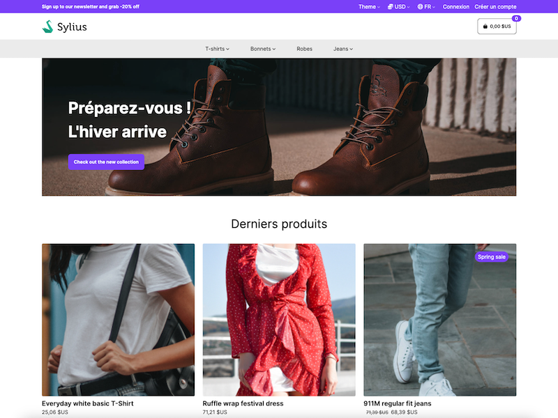
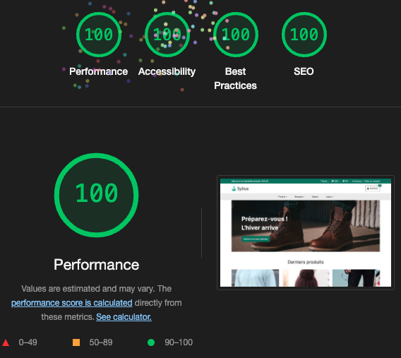
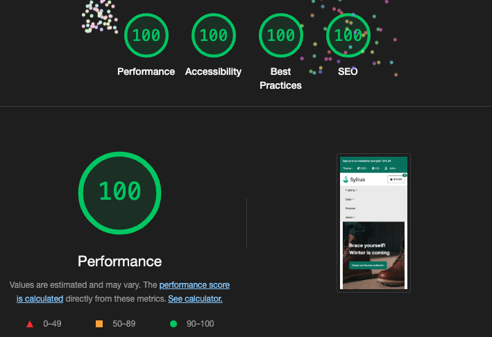

    
    <h1 align="center">SyliusTailwindcssTheme</h1>
    
A Sylius theme powered by Tailwindcss, DaisyUI with build process based on <a target="_blank" href="https://symfony.com/doc/current/frontend.html">Webpack Encore.</a>
     By <a target="_blank" href="https://www.adeliom.com">Adeliom</a>

    

### Try our demo 🚀 [https://sylius-tailwind.adeliom.io/](https://sylius-tailwind.adeliom.io/)

## Preview

### Homepage

### [View more](./docs/screenshots.md)

### Performance tests

    
Desktop

    

    

    
Mobile

    

    

## Why Tailwindcss & DaisyUI

TODO

## Documentation

[Documentation is available in the *docs* folder.](docs/index.md)

## Bug Tracking

If you want to report a bug or suggest an idea, please use [GitHub issues](https://github.com/agence-adeliom/sylius-tailwindcss-theme/issues).

## License

This theme uses [MIT License](LICENSE.md).

## Authors

The theme was originally created by [Adeliom](https://www.adeliom.com).
See the list of [contributors](https://github.com/agence-adeliom/sylius-tailwindcss-theme/contributors).

## Contribution

[Documentation is available in the *docs/contribution.md* file.](docs/contribution.md)
