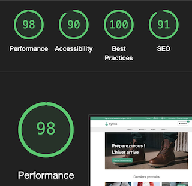

# SyliusTailwindcssTheme
A Sylius theme powered by Tailwindcss, DaisyUI, SyliusThemeBundle, WebpackEncoreBundle.
By [Adeliom](https://www.adeliom.com)

## Why Tailwindcss & DaisyUI

TODO

## Discover

| Discover         |                                                                                  |
|:-----------------|---------------------------------------------------------------------------------:|
| Demo             |                                [Visit our demo site](https://www.adeliom.com) 🚀 |
| Screenshots      |  [View more](./docs/screenshots.md) |
| Performances     |                                               |

## Documentation

[Documentation is available in the *docs* folder.](docs/index.md)

## Bug Tracking

If you want to report a bug or suggest an idea, please use [GitHub issues](https://github.com/royalphp/sylius-bootstrap-theme/issues).

## License

This theme uses [MIT License](LICENSE.md).

## Authors

The theme was originally created by [Adeliom](https://www.adeliom.com).
See the list of [contributors](https://github.com/agence-adeliom/sylius-tailwindcss-theme/contributors).

## Contribution

[Documentation is available in the *docs/contribution.md* file.](docs/contribution.md)
