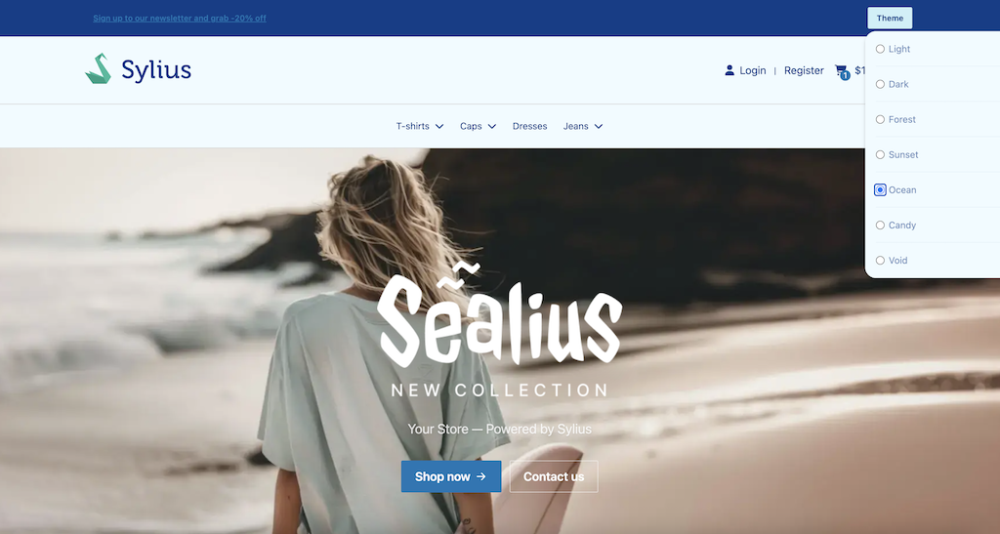
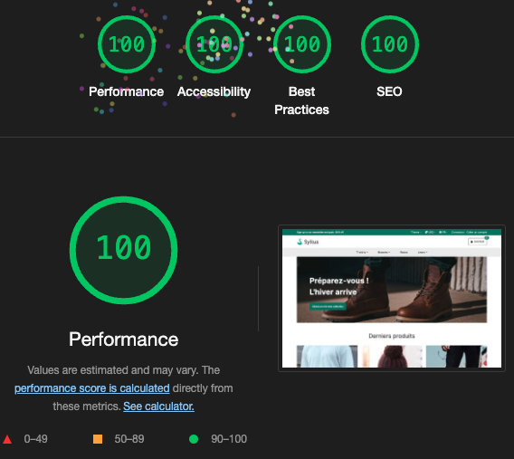
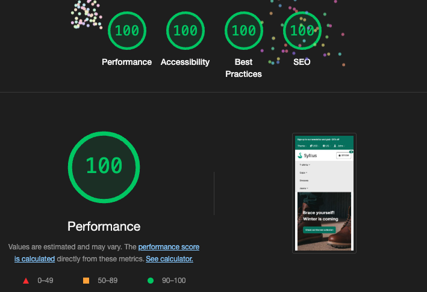

    
    <h1 align="center">SyliusTailwindcssTheme</h1>
    
A Sylius theme powered by Tailwindcss, DaisyUI with build process based on <a target="_blank" href="https://symfony.com/doc/current/frontend.html">Webpack Encore.</a>
     By <a target="_blank" href="https://www.adeliom.com">Adeliom</a>

[//]: # (
)
[//]: # (    )
[//]: # (
)

### Try our demo 🚀 [https://sylius-tailwind.adeliom.io/](https://sylius-tailwind.adeliom.io/)
### NEW ✨ Compatible with Sylius 2.0

## Introduction

- A Sylius front-end alternative based on Tailwindcss 4 and daisyUI 5, 
- Pure CSS UI components
- Create themes with zero effort
- Only `5kB` of Javascript & `45kB` of CSS
- Start your Sylius projects with an optimized code : 💯 in Lighthouse page load report
## Preview

### [View more](./docs/screenshots.md)

### Performance tests

    
Desktop

    

    

    
Mobile

    

    

## Documentation

[Documentation is available in the *docs* folder.](docs/index.md)

## Claude Code integration

If you use [Claude Code](https://claude.ai/code) in your Sylius project, you can leverage the maintenance commands bundled with this theme to keep your customized templates in sync with upstream Sylius updates.

[Documentation is available in the *docs* folder.](docs/ai.md)

## Bug Tracking

If you want to report a bug or suggest an idea, please use [GitHub issues](https://github.com/agence-adeliom/sylius-tailwindcss-theme/issues).

## Authors

The theme was created by [Adeliom](https://www.adeliom.com).

[//]: # ([![]&#40;https://contrib.rocks/image?repo=agence-adeliom/sylius-tailwindcss-theme&#41;]&#40;https://github.com/agence-adeliom/sylius-tailwindcss-theme/graphs/contributors&#41;)

## License

This theme uses [MIT License](LICENSE.md).

